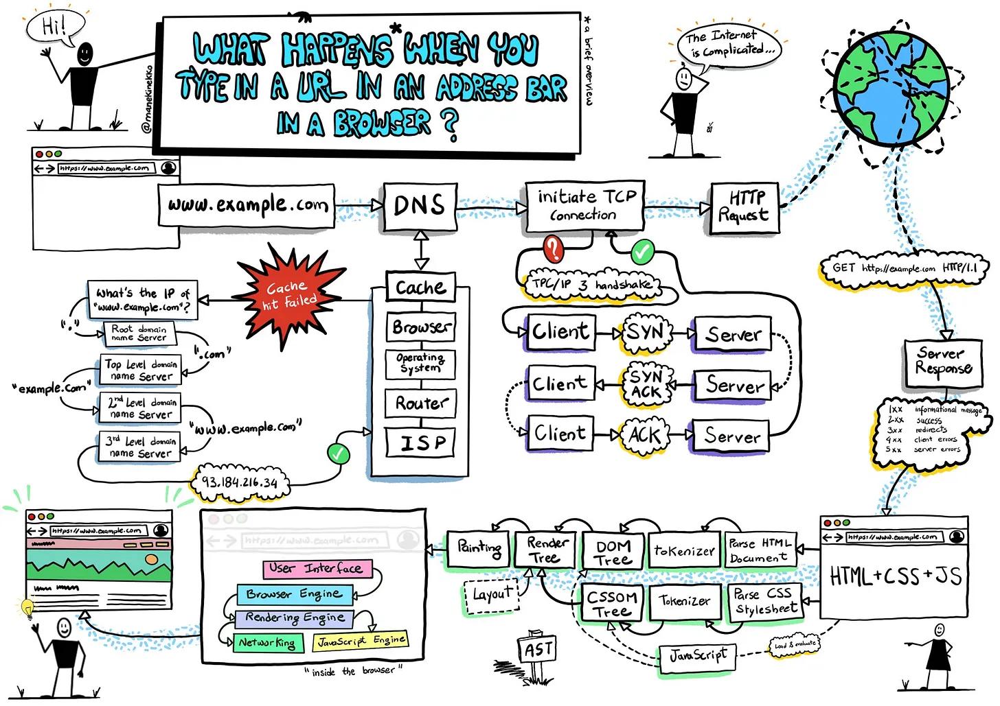

# What Happens When You Type a URL into Your Browser?

When you type a URL like [https://google.com](https://google.com) into your browser and press <code>ENTER</code>, **six crucial steps** occur behind the scenes:

---

## 1. Initialization

The browser begins by analyzing the URL:

- The `https://` scheme tells the browser to initiate a secure connection using **TLS (Transport Layer Security)**.

---

## 2. DNS Lookup

The browser needs to figure out which server on the Internet to connect to. It must look for the IP address of the server hosting the website using the domain you typed to accomplish that. DNS lookup is used to do this. Here, it determines whether we can locate it in the cache; if not, DNS must search domain name servers from the root to the third level

The **Domain Name System (DNS)** acts like the internet's phone book, translating human-friendly domain names into machine-readable IP addresses.

The browser follows this cache lookup order:

1. **Browser Cache** – Looks for previously visited sites.
2. **OS Cache** – Queries your computer’s stored DNS records.
3. **Router Cache** – Checks for DNS data in the router.
4. **ISP DNS Server** – If all else fails, contacts your Internet Service Provider's DNS server.

---

## 3. TCP Connection Establishment

Once the IP address is resolved, the browser initiates a **TCP (Transmission Control Protocol)** connection with the server.

- TCP ensures reliable data transmission.
- The request travels through multiple layers:
  - Browser → Router → ISP → Internet exchange → Destination server.
- **CDNs (Content Delivery Networks)** help optimize this process by serving content from locations nearer to you.

---

## 4. Sending the HTTP Request

With the TCP connection in place, the browser sends an **HTTP (or HTTPS)** request to the server.

- The request includes:
  - A **request line**
  - **Headers**
  - (Optionally) a **body**
- This tells the server what data the browser wants (e.g., HTML content).

---

## 5. Server Response

The server receives the request and processes it accordingly.

- It sends back an **HTTP response** containing:
  - A **status code** (e.g., 200 OK, 404 Not Found)
  - **Response headers**
  - **The requested content**

Example:  
A `GET /page/ HTTP/1.1` request retrieves the specified page content.

---

## 6. Rendering the Page

The browser receives the response and begins **rendering the page**.

- It uses the `Content-Type` header to identify the content (e.g., HTML, CSS, JS).
- It then loads and displays the page, including making additional requests for images, scripts, or stylesheets as needed.

---

## Conclusion

All of these steps happen in just a few **seconds**.

While it may seem complex, modern browsers and web infrastructure make it seamless allowing users to access websites effortlessly.
